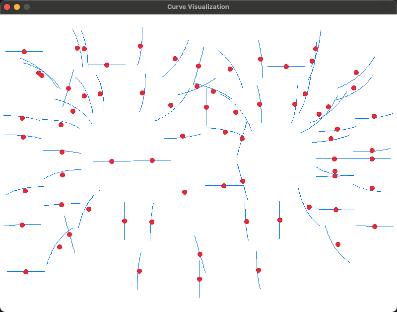

# eigencurve

Load curves from some font, using Singular value decomposition (SVD) to get a low rank approximation of the curves.

process, run SVD and save results to a json file
```
    cargo run --bin process -- <font_file_path> <save_result.json>
```

visualize, load the result and visualize the curves in a 2D space. (We will first project the coefficient of the basis by PCA into a 2D space)
```
    cargo run --bin visualize -- <save_result.json>
```


